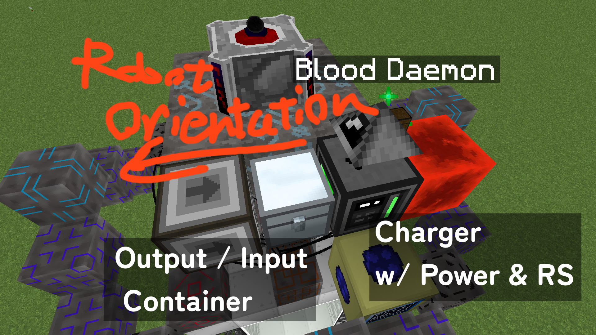
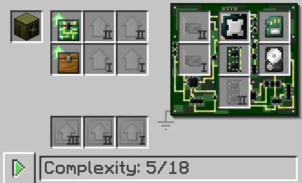

# Blood Daemon OC
**Open Computers program for Blood Altar automation**

## Features
- Blood orb / crafting switch
- Some handling for exceptional operations
    - Craft cancelling (remove item from altar)

## Layout

## Hardware Requirements

- Tier 2 Case
- Inventory Controller Upgrade
- Inventory Upgrade
- Any CPU
- Any RAM
- BIOS
- Any HDD

Monitor is not required, if you know what you do.
